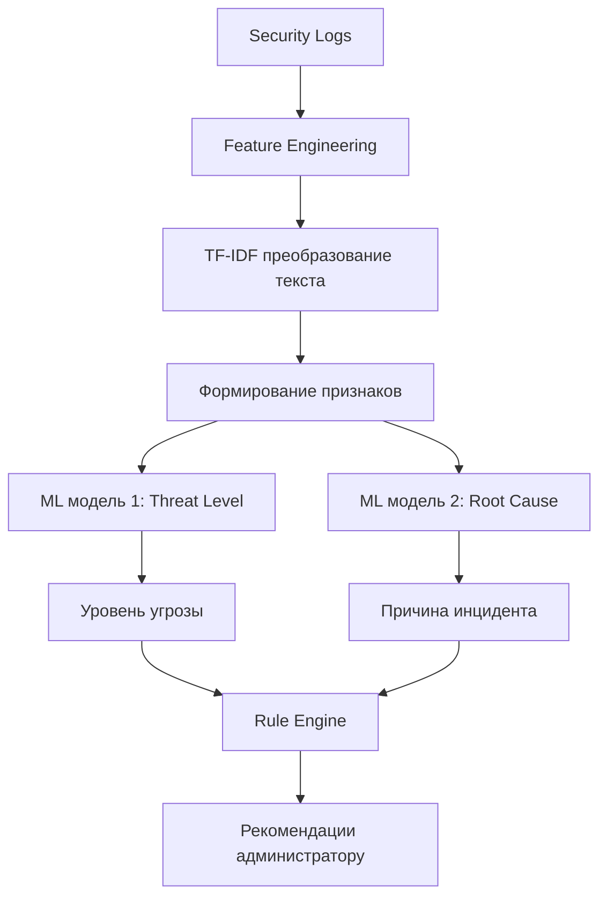

## Архитектура системы анализа инцидентов

```mermaid
flowchart TD

A[Security Logs] --> B[Feature Engineering]

B --> C[TF-IDF преобразование текста]

C --> D[Формирование признаков]

D --> E[ML модель 1: Threat Level]
D --> F[ML модель 2: Root Cause]

E --> G[Уровень угрозы]
F --> H[Причина инцидента]

G --> I[Rule Engine]
H --> I

I --> J[Рекомендации администратору]
```
